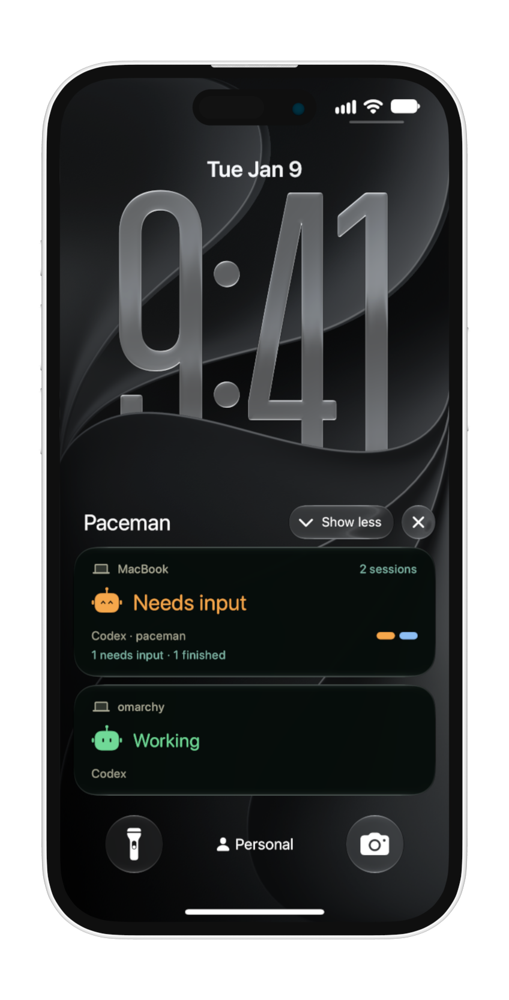
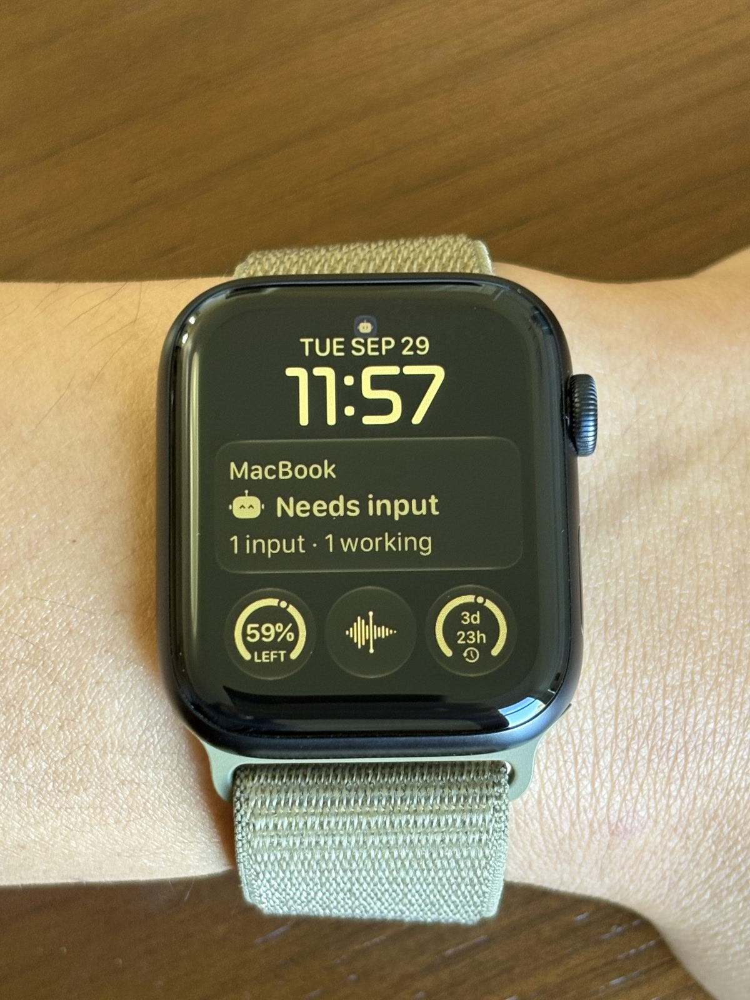
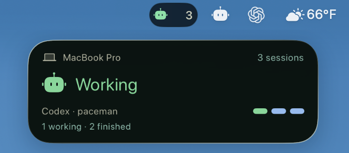
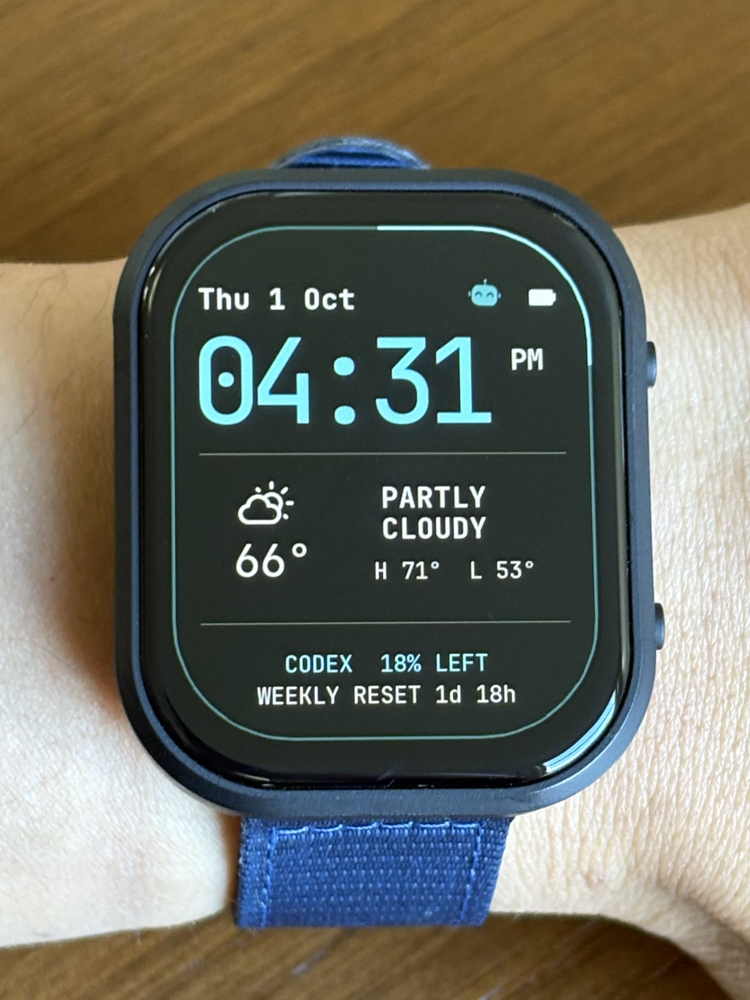

# Paceman

**Take your agents for a walk.**

Paceman is a personal gear system for agentic engineering. Agents keep working
while your attention is elsewhere. Paceman gives that work a quiet presence in
the gear you take with you, so you can stay in touch without being tied to your
desk.

Paceman shows Codex and Claude Code activity in Live Activities on the iPhone
Lock Screen, Apple Watch Smart Stack, and Mac menu bar. Apple Watch complications
show how much Codex usage remains and when it resets.

Paceman is in **alpha**. Desktop installers are available, and the iPhone app
is available through TestFlight.

  
  

  

You can also try [Paceman Watch](firmware/esp32-watch/README.md), an experimental
ESP32-S3 watch built for quick glances at agent activity without the usual
smartwatch distractions. It’s a working demo of Paceman’s longer-term goal: an
open system you can extend to the personal gear you choose or build. New devices
still need custom firmware and iPhone pairing support today.

  

## Get started

1. **[Get Paceman for iPhone on TestFlight](https://testflight.apple.com/join/wpMWQb7d)**. Open the link on your iPhone; iOS 18 or later is required.
2. **[Download the desktop client](https://github.com/iamjamesim/Paceman/releases)** and follow the [Mac setup](macos/README.md) or [Omarchy setup](omarchy/README.md) guide.
3. Review the enabled agent hooks, connect [Tailscale](https://tailscale.com/download) on your computer and iPhone, and scan the pairing code. The setup guides walk through these checks; Paceman prepares the private connection when Tailscale permits it.

Prefer source installation? See [Mac source setup](macos/README.md#build-and-install-from-source)
or [Omarchy source setup](omarchy/README.md#install-from-a-git-checkout).

The Mac and Omarchy installers configure the [APNs relay](service/RELAY.md) for
locked-phone notifications by default; the iPhone must still allow notifications.
The Apple Watch app requires watchOS 26 or later.

Developers can [build the iPhone app with Xcode](docs/development.md#iphone-and-live-activities-mac).

## Understand the system

Start with [architecture](docs/architecture.md) for the end-to-end flow. Then read
[data and lifecycle](docs/data-lifecycle.md) for what survives outages and
[push delivery](docs/push-delivery.md) for updates while the phone is asleep.

For exact formats, use the [protocol](docs/protocol.md). The
[ESP32 watch connection](firmware/esp32-watch/CONNECTION.md) covers its
Bluetooth recovery; [relay setup](service/RELAY.md) is for operators.

## Repository

| Path | Purpose |
| --- | --- |
| `service/` | Local source API, pairing, persistence, push worker and APNs relay |
| `macos/` | Menu-bar app, Codex and Claude hooks, per-user installer |
| `omarchy/` | Omarchy bar panel, Codex and Claude hooks, source controls and installer |
| `ios/` | iPhone app, Live Activities, Apple Watch app and complications |
| `firmware/esp32-watch/` | Experimental watch firmware and simulator |
| `tests/`, `scripts/` | Portable checks and development tools |

The ESP32 package derives from [Omarchy Watch](https://github.com/iamjamesim/omarchy-watch).
Its [provenance](firmware/esp32-watch/UPSTREAM.md) is retained. New Paceman code
uses [Apache 2.0](LICENSE); imported code and assets have
[third-party notices](THIRD_PARTY_NOTICES.md). Contributors can start with the
[development guide](docs/development.md) for builds and tests.
