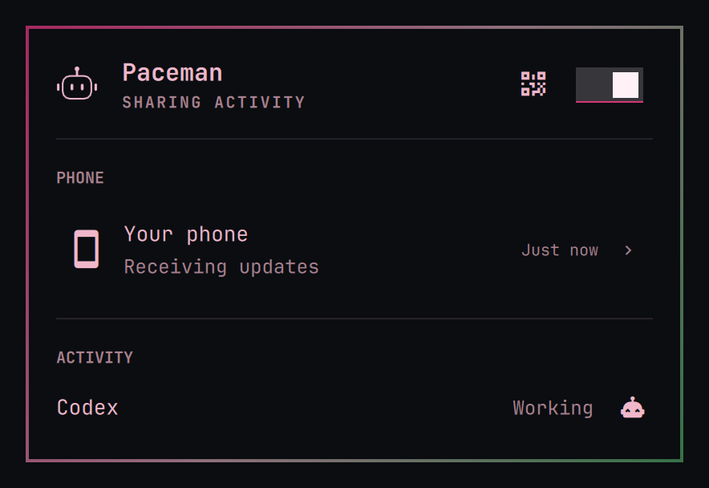
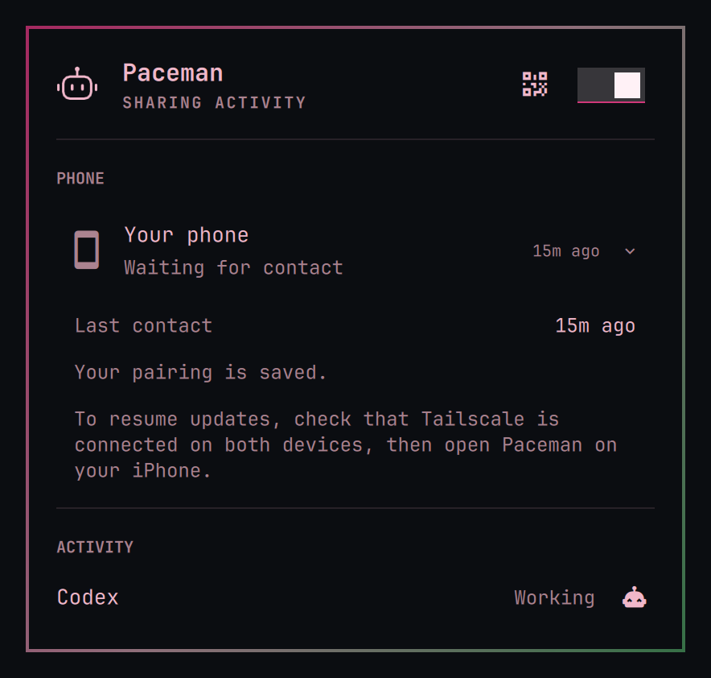
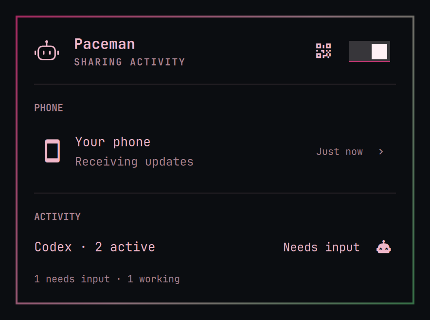
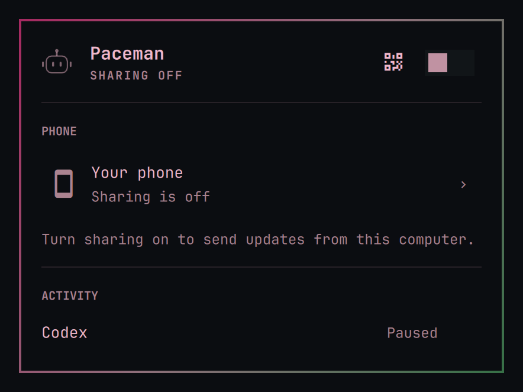
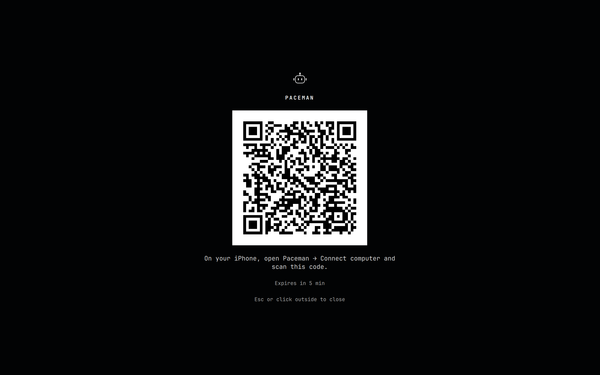

# Desktop visual reference

Canonical Omarchy desktop states for design review and macOS implementation.
Captured 2026-09-18 from the production panel components at `02ebc5c`.
These are **sample states**, not live phone/watch delivery evidence. Times are
frozen, animation is paused, and the pairing QR is deliberately nonfunctional.

The [panel design](desktop-panel-design.md) defines behavior; these images show
its current implementation. Keep this small set current rather than collecting
an archive of screenshots from design iterations.

## Overview



The header identifies Paceman and this computer's sharing state. It contains the
single pairing entry point and the persistent sharing switch. Phone contact and
local activity are separate sections. The status words stay readable beside a
robot in a fixed trailing slot; Working gently pulses in the running app.

## Phone details expand inline



Clicking the phone row reveals details directly below it. The header and local
activity remain visible. A phone that has stopped fetching does not require a
new pairing. Escape collapses the details before closing the panel.

## Multiple active sessions



The main row presents the highest-priority state. A smaller breakdown appears
only when ongoing sessions have different states. Matching states stay on one
line, such as “2 working.” Retained completions do not inflate the active count.
The robot's position stays fixed as the wording changes.

## Sharing off



Off stops this computer's source and disables login startup. It preserves pairing
and stays off across login and upgrades. Closing the menu or restarting the shell
does not otherwise stop the background source.

## Pairing overlay



The header QR button closes the bar panel and opens a focused workspace overlay,
matching Omarchy's Wi-Fi QR interaction. It shows where to scan, expiry, and how
to dismiss it. Escape or clicking outside closes it. Expired codes can be renewed.
This reference uses a plain backdrop in place of real desktop contents and an
invalid example invitation; it cannot pair a device.

## What macOS should preserve

| Preserve across platforms | Adapt to native macOS conventions |
| --- | --- |
| Paceman identity and header/action hierarchy | Menu-bar icon rendering and popover chrome |
| Separate local sharing, phone contact, and agent activity | System typography, materials, spacing, and colors |
| Inline phone disclosure, with no navigation stack in the small panel | Native disclosure and keyboard/focus behavior |
| One QR entry point and a focused pairing presentation | Appropriate Mac window/presentation for pairing |
| Stable activity mark, explicit words, compact multi-session summary | Native drawing and motion/accessibility settings |
| Persistent sharing choice independent of the menu's lifetime | macOS background-service and login-item implementation |

Do not copy Linux service names, Nerd Font glyph dependencies, theme colors, or
pixel dimensions into the Mac product as requirements. The information hierarchy
and meaning of controls are the shared contract.

## Current limits

“Your phone” describes the intended iPhone workflow; pairing currently identifies
anonymous credentials, not distinct physical phones. Recent authenticated fetches
also include diagnostic clients and do not prove watch delivery. “Active” counts
reported Working/Needs input states, not verified open windows. Phone identity
and session/process liveness are explicit [follow-ups](roadmap.md).

## Refreshing the references

On an Omarchy desktop with Quickshell, `qrencode`, and `grim` installed:

```sh
bash scripts/capture-desktop-reference.sh
```

The script uses [reference.qml](../desktop/reference.qml) to render the same
`PanelContent` and `PairingOverlay` used by the installed app. Fixtures are inert:
they do not read the source database, contact the phone, or change sharing. It
briefly displays each state, captures the component against a plain background,
and replaces the five PNGs under `docs/images/desktop/` after successful capture.
The active Omarchy theme and display scale determine rendering.

Review every image, update the capture date/source revision above, and commit
the images with any corresponding behavior/caption changes. Keep the fixed
filenames so links remain stable. Do not substitute screenshots containing real
pairing codes, tokens, or private workspace contents.
