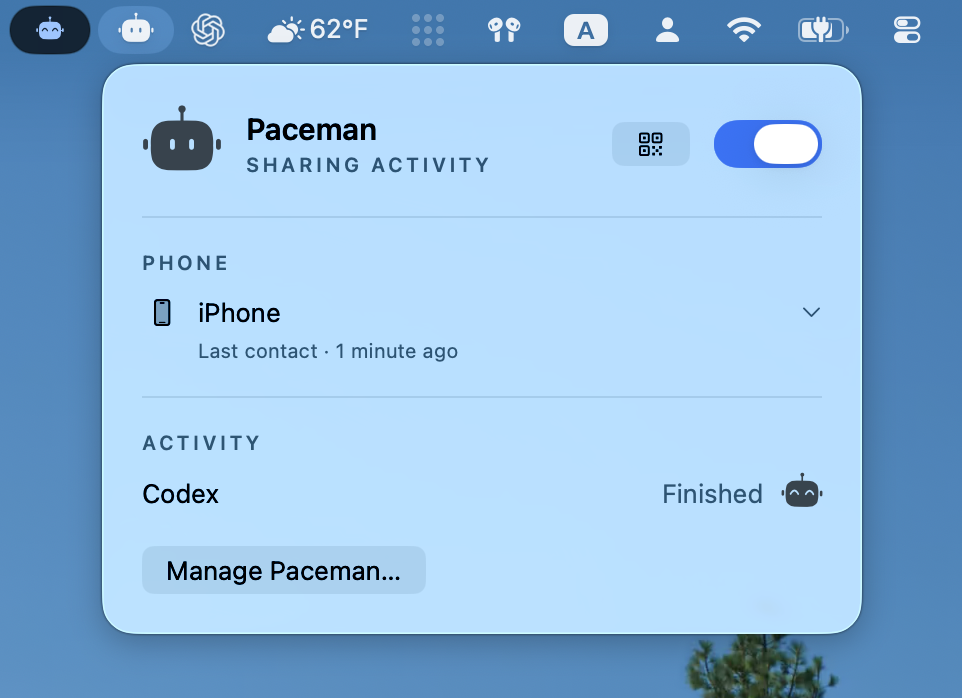

# Mac installation

The Mac client has one **Paceman** background item for the local source and notification sender. The menu-bar app controls Sharing and phone access. It opens at login by default, independently of Sharing. Codex hooks supply activity; the phone connects over private Tailscale HTTPS.

## Prebuilt Mac release

When a signed, notarized Mac release is published, download its **Apple Silicon DMG** from the matching [GitHub release](https://github.com/iamjamesim/paceman/releases). Open `Paceman.app` in the disk image and choose **Install Paceman**. It copies itself to `~/Applications/Paceman.app`, installs the per-user background item and Codex hooks, and prepares the relay sender. During alpha, quit a running Paceman before opening a newer DMG and choosing **Update Paceman**; pairing data and Sharing preference are kept. The prebuilt app includes Python and its relay-client packages, so users do not need Xcode, Homebrew, or a separate Python. It supports Apple Silicon and macOS 15 or newer.

The first public Mac build uses bundle ID `ai.paceman.macos`. Check **System Settings → General → Login Items & Extensions** after installation. If the menu app reports that Open at Login needs attention, set it in **Manage Paceman…**.

Continue with **Review Codex hooks** below, then configure the private Tailscale route and pair the phone. The menu app confirms when a fresh Codex event reaches Paceman; a terminal check with `pacemanctl status` is also available. Local dry-run DMGs are ad hoc signed and are not public downloads.

## Install from source and pair

From the repository root, use Python 3.11+ installed outside the checkout, Xcode, and an Apple Silicon Mac:

```sh
python3 -m macos.install
```

The installer builds the menu app and helper, copies the source to `~/Library/Application Support/Paceman`, prepares notifications through `https://relay.paceman.ai`, installs a per-user background item, and adds eight Paceman commands to `~/.codex/hooks.json`. The relay keeps the APNs signing key; the Mac stores only a source credential. Re-running preserves an existing relay or direct APNs configuration, pairings, Sharing choice, and unrelated hooks. If notification setup fails, the installer reports that the source is installed but notifications are incomplete. If the selected `python3` is too old, invoke a newer interpreter explicitly. A different Mac architecture needs a matching build target in the installer.

For a self-hosted relay, pass `--relay-url https://YOUR-RELAY` to the installer. Developers managing a direct APNs sender can use `--no-push-setup` and follow [development-only direct APNs](../docs/push-delivery.md#development-only-direct-apns). Neither option is needed for the normal install.

Open `~/Applications/Paceman.app` and confirm **Paceman** appears in **System Settings → General → Login Items & Extensions**. Configure a private Tailscale Serve HTTPS route to `http://127.0.0.1:8765`; leave Funnel off. The source binds only to loopback. The installer does not alter Tailscale routes. Once notification setup has succeeded, use the menu-bar QR button to create a five-minute invitation, then scan it from **Connect computer** on the iPhone. This first pairing includes the relay address. Treat the QR and invitation as pairing secrets.

## Review Codex hooks

Installing and pairing do not enable session monitoring. Codex requires the user to review each new or changed hook. The installer prints the **exact command** for this installation: its selected Python interpreter, the `-B` flag, and the absolute path to `~/Library/Application Support/Paceman/lib/macos/codex_hook.py`. Compare that printed command with every expanded Paceman row. In a prebuilt install the interpreter is inside `~/Applications/Paceman.app`; with Homebrew Python on a source install, its shape is:

```sh
/opt/homebrew/bin/python3 -B '/Users/YOU/Library/Application Support/Paceman/lib/macos/codex_hook.py'
```

The Mac menu app also shows **Review Codex hooks…** under Activity during setup. It displays the installed command, the eight event purposes, and whether a new event reached Paceman after you opened the guide. App users can finish this check without running `pacemanctl`.

In the Codex app, open **Settings → Hooks → User config (All projects)**. In the CLI, enter `/hooks` or select **Review hooks** at startup. Codex calls each command **Hook 1**; expand the event row to verify **User config — ~/.codex/hooks.json** and the installed command. The user decides whether to trust each Paceman row individually.

| Event row | Purpose |
| --- | --- |
| `SessionStart` | Show a new task as idle. |
| `UserPromptSubmit` | Show work after a prompt. |
| `PermissionRequest` | Show pending approval after five seconds. |
| `PreToolUse` | Show a pending blocking or async question after five seconds. |
| `PostToolUse` | Resume work after a tool finishes. |
| `Stop` | Show a finished turn. |
| `Interrupt` | Show an interrupted turn as idle. |
| `SessionEnd` | Remove a closed session. |

The hook sends the event name, opaque session and turn IDs, and possibly a short project label to Paceman's private local socket. It sends no prompts, replies, transcripts, tool arguments, or full paths. A project label may appear on the iPhone Lock Screen. Do not trust hooks on the user's behalf or bypass their review.

After review, start a **fresh local Codex task** on this Mac and send a prompt. Verify that the task appears and `lastAgentEventAt` advances:

```sh
"$HOME/Library/Application Support/Paceman/bin/pacemanctl" status
```

If it does not, inspect the pending hook rows and installed command. Report installation as partial until a real event arrives. Hook presence alone does not establish trust or delivery. The app shows **Setup needed** for missing commands, **No activity yet** before its first received event, and **No active work** after an observed session becomes idle.

## Check iPhone notifications

The installer prepares the sender through Paceman's [project-operated relay](../service/RELAY.md) before the first pairing. The phone must allow notifications and register its Apple-issued device token. A developer who skipped relay setup or needs to repair it can run:

```sh
python3 -m macos.install_push --relay-url https://relay.paceman.ai
```

Use the Python 3.11+ command printed by the source installer if needed. The sender shares Paceman's background item and stores its credential in the owner-only `~/Library/Application Support/Paceman/private/apns.json`. An already paired phone needs a fresh QR pairing if relay setup was added later. After hook review, start a new local Codex task and check `~/Library/Application Support/Paceman/data/push-delivery.jsonl` for `apns_accepted` (status 200), then confirm a **new notification on the physical iPhone**. APNs acceptance alone does not prove display. See [push delivery](../docs/push-delivery.md) for ESP32 and Apple Watch delivery.

## Control and removal

**Sharing off** pauses the source and sender but keeps hooks, pairing, and push configuration. **Manage Paceman… → Open menu app at login** is separate, so the menu remains available while sharing is paused. **Remove access…** revokes one phone. **Manage Paceman… → Uninstall Paceman…** removes the app, background item, hooks, pairing data, and relay credential; remove a dedicated Tailscale Serve route separately. Local Apple Development or ad hoc signatures are not Developer ID signatures or notarization.

<p align="center">
  <a href="images/menu-bar-app.png"></a>
</p>

## Coverage limits

An unrelated user message can clear async-question attention early; a completed turn clears it. Without `SessionEnd`, a Finished row can remain for up to ten minutes. Mac hooks cannot verify process ownership. The source reads Codex allowance through a short-lived local App Server every five minutes and sends only the percentage, window, observation time, and reset time.
